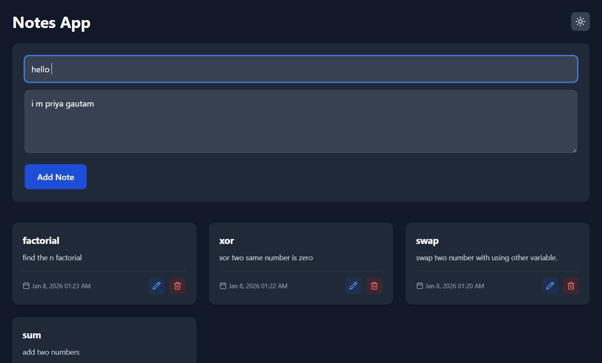
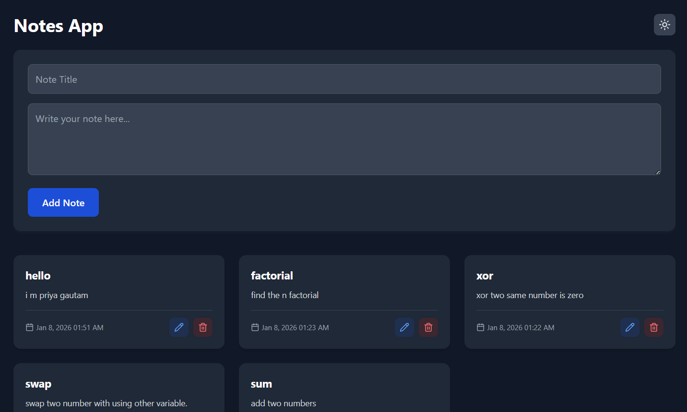
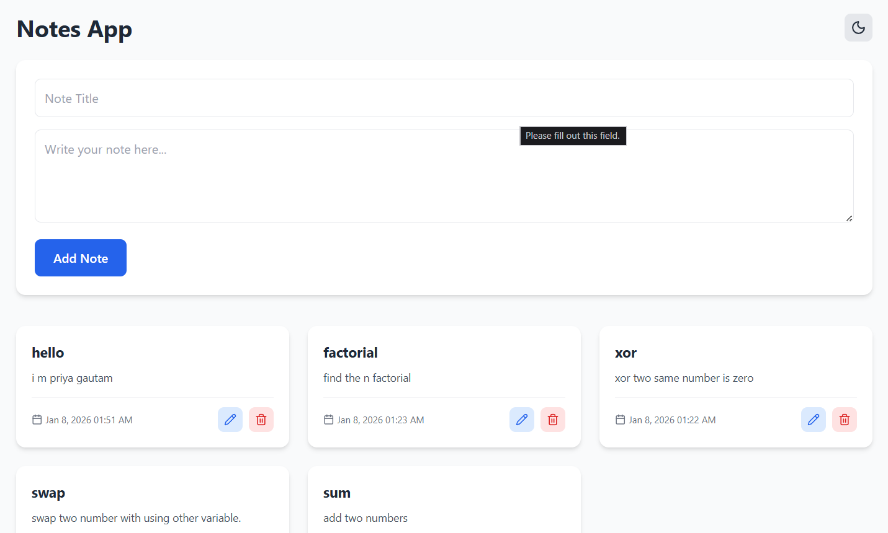
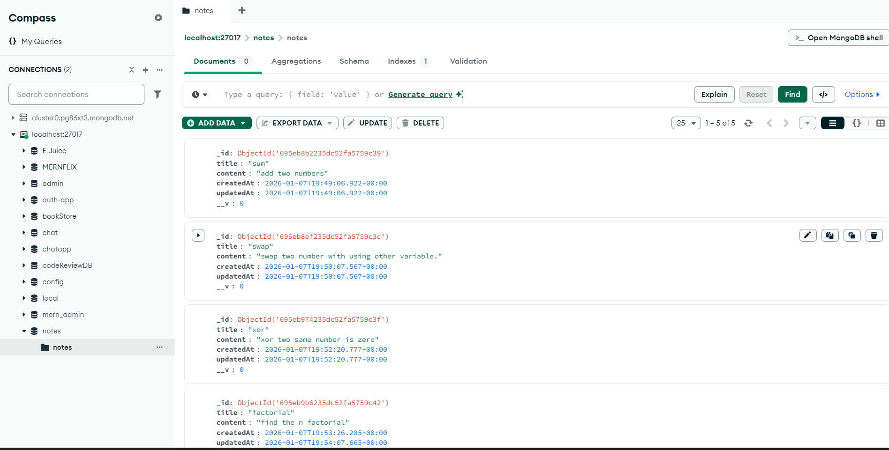

# Notes App

A modern, responsive note-taking application built with Next.js, TypeScript, and MongoDB, designed for effortless note management and a clean, intuitive interface.

## Screensorts

### add Note



### Dark Theme Output



### Light theme Output



### DATABASE



## Features

- **Create, Read, Update, Delete (CRUD)**: Full notes management functionality
- **Responsive Design**: Works on mobile, tablet, and desktop devices
- **Dark/Light Mode**: Toggle between themes with the theme switcher
- **Modern UI**: Clean, intuitive interface with card-based layout
- **Real-time Data**: Notes are saved and updated in real-time
- **MongoDB Integration**: Secure backend storage for your notes

## Tech Stack

- **Frontend**: Next.js 16.1.1, React 19.2.3
- **Styling**: Tailwind CSS, Lucide React icons
- **Database**: MongoDB with Mongoose ODM
- **TypeScript**: Strongly typed codebase
- **API Routes**: Next.js App Router API routes

## Installation

1. Clone the repository:

   ```bash
   git clone <repository-url>
   ```

2. Navigate to the project directory:

   ```bash
   cd notes-app
   ```

3. Install dependencies:

   ```bash
   npm install
   ```

4. Set up environment variables:
   Create a `.env.local` file in the root directory with your MongoDB connection string:
   ```
   MONGODB_URI=your_mongodb_connection_string
   ```

## Running the Application

1. Start the development server:

   ```bash
   npm run dev
   ```

2. Open your browser and visit: [http://localhost:3000](http://localhost:3000)

## Usage

- **Add a Note**: Fill in the title and content fields and click "Add Note"
- **Edit a Note**: Click the pencil icon on any note card
- **Delete a Note**: Click the trash icon on any note card
- **Toggle Theme**: Use the sun/moon icon in the top right corner to switch between light and dark modes

## Project Structure

```
notes-app/
├── app/
│   ├── api/
│   │   └── notes/
│   │       ├── [id]/
│   │       └── route.ts
│   ├── globals.css
│   ├── layout.tsx
│   └── page.tsx
├── components/
│   ├── NoteCard.tsx
│   ├── NoteForm.tsx
│   ├── NoteList.tsx
│   └── ThemeToggle.tsx
├── lib/
│   └── mongodb.ts
├── models/
│   └── Note.ts
└── README.md
```

## API Endpoints

- `GET /api/notes` - Get all notes
- `POST /api/notes` - Create a new note
- `PUT /api/notes/:id` - Update an existing note
- `DELETE /api/notes/:id` - Delete a note

## Contributing

1. Fork the repository
2. Create a feature branch (`git checkout -b feature/amazing-feature`)
3. Commit your changes (`git commit -m 'Add amazing feature'`)
4. Push to the branch (`git push origin feature/amazing-feature`)
5. Open a Pull Request

## License

This project is licensed under the MIT License.
